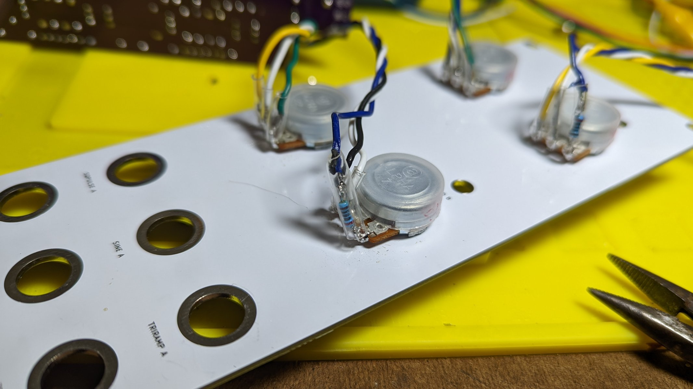
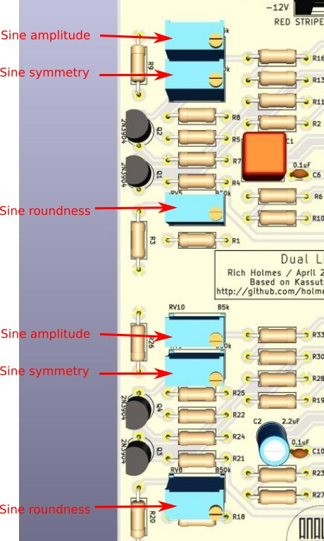

# Dual LFO build notes

## ERRATA

OK, pay attention, this is going to be messy...

On the first run PCBs (no version # shown):

* The silkscreen labels for the Molex connector pins are backwards, CW should be CCW and vice versa. HOWEVER,
* The shape pot Molex connector pins are *connected* backwards, which means the silkscreen labels actually should be taken as correct for those pots. So connect CW (clockwise, viewed from front) pot pins to the "CCW" Molex pins for the frequency pots, and vice versa, but CW to CW and CCW to CCW for the shape pots. Got that?
* R2 and R19, shown as 100R, should be changed to 300R
* 200R resistors should be added between the counterclockwise pot pins and their wires on the shape pots:

* Trim pots lack silkscreen labels, they are as shown:

* "Analog Ouput" label on front panel should be "Kassutronics".

These have been corrected on v1.0 (version # shown on silkscreen) and later boards.

## Build

It's a straightforward build aside from the errata. Do the usual.

Adjust sine roundness trim pots to get as close to a sine as possible. Adjust sine symmetry trim pots to correct for differences between top and bottom of waveform shapes. Finally adjust sine amplitude trim pots for ±5 V.

