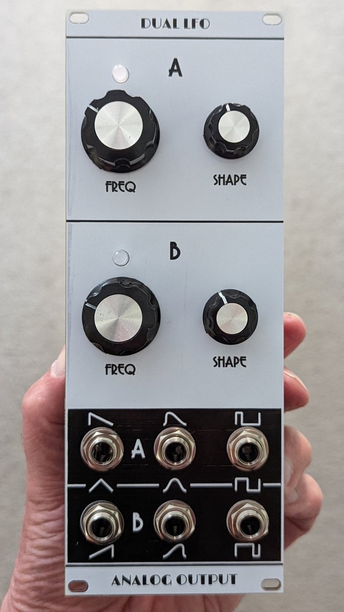
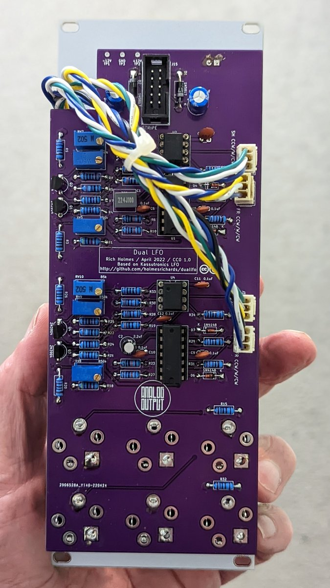

# Shape variable dual LFO

This is a dual LFO synth module in Kosmo format, based on a [Kassutronics design](https://kassu2000.blogspot.com/2015/10/variable-waveshape-lfo.html). There are three outputs for each LFO. Depending on the shape pot setting these provide ramp, asymmetric triangle, symmetric triangle, or sawtooth waveforms; sine or skewed "sine" waveforms; and narrow, square, or wide pulse waveforms respectively.

Version 1.0 corrects some first run problems. Version 1.0 PCB has not been tested.

## Current draw
? mA +12 V, ? mA -12 V


## Photos





## Documentation

* [Schematic](Docs/kdlfo.pdf)
* PCB layout: [front](Docs/kdlfo_layout_front.pdf), [back](Docs/kdlfo_layout_back.pdf)
* [BOM](Docs/kdlfo_bom.md)
* [Build notes](Docs/build.md)
* [Blog post](https://analogoutputblog.wordpress.com/2022/05/11/kassutronics-dual-lfo/)

## GitHub repository

* [https://github.com/holmesrichards/duallfo](https://github.com/holmesrichards/kdlfo)

## Submodules

This repo uses submodules aoKicad and Kosmo_panel, which provide needed libaries for KiCad. To clone:

```
git clone git@github.com:holmesrichards/kdlfo.git
git submodule init
git submodule update
```


Alternatively do

```
git clone --recurse-submodules git@github.com:holmesrichards/kdlfo.git
```

Or if you download the repository as a zip file, you must also click on the "aoKicad" and "Kosmo\_panel" links on the GitHub page (they'll have "@ something" after them) and download them as separate zip files which you can unzip into this repo's aoKicad and Kosmo\_panel directories.

If desired, copy the files from aoKicad and Kosmo\_panel to wherever you prefer (your KiCad user library directory, for instance, if you have one). Then in KiCad, go into Edit Symbols and add symbol libraries 

```
aoKicad/ao_symbols
Kosmo_panel/Kosmo
```
and go into Edit Footprints and add footprint libraries 
```
aoKicad/ao_tht
Kosmo_panel/Kosmo_panel.
```
